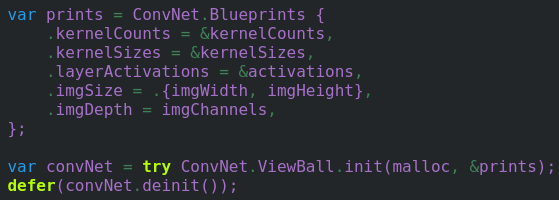

# C2D2.ViewBall
Dense complex number propagating and relatively branchless FFT-based convolutional neural network in Zig utilizing dynamic padding

Yo this is cool

Example creation (Used to classify some cx28x28 images):

Enjoy!

